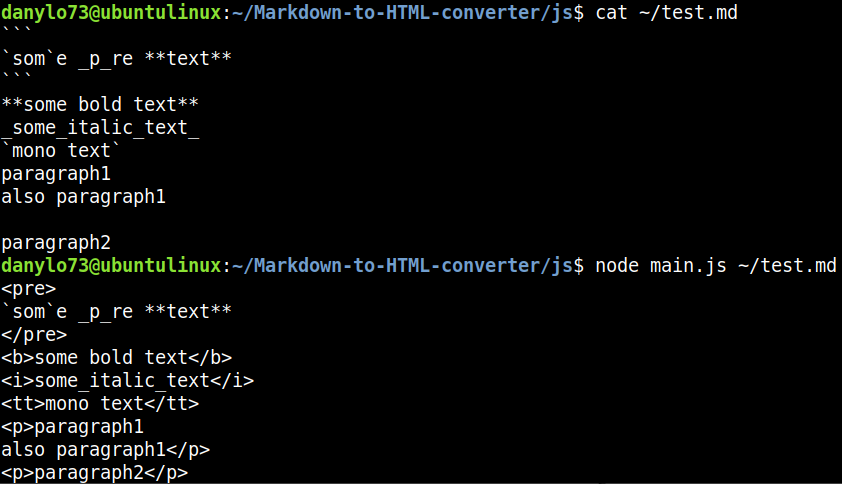
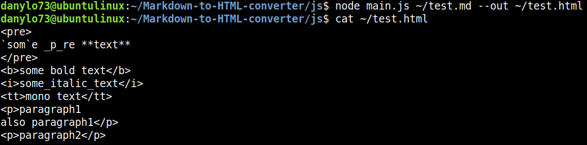
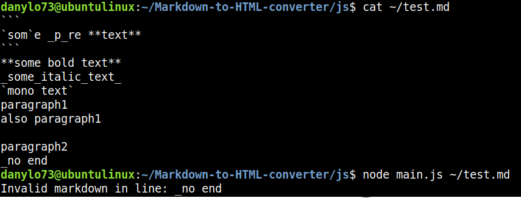
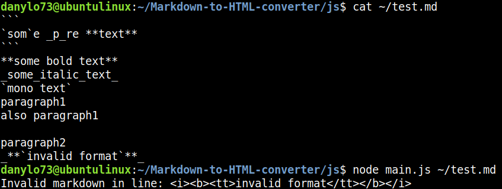

# Markdown to HTML converter

Це простий консольний застосунок для конвертації синтаксису `Markdown` в синтаксис `HTML`. 

Наразі наявна обмежена кількість тегів md, що конвертуються в html. 

Застосунок підримує декілька варіантів виводу результатів конвертації:

- Вивід в консоль (stdout)
- Запис у файл

## Інструкція зі встановлення

1. Переконайтеся, що на вашій машині встановлено `Node.js`

Встановити його можна [тут](https://nodejs.org/en/download)

Або через термінал:

```bash
sudo apt install nodejs
```

2. Зклонуйте цей репозиторій на свою локальну машину та перейдіть до директорії, де знаходиться головний файл застосунку

```bash
git clone https://github.com/DanyloM73/Markdown-to-HTML-converter.git
```

```bash
cd Markdown-to-HTML-converter/js
```

**Тепер застосунок готовий до використання**

## Інструкція до використання

- Для того, щоб користуватись застосунком достатньо мати вказати шлях до файлу `.md`, за замовченням результат роботи застосунку виводиться у консоль (stdout)

```bash
node main.js file.md
```

<p align="center">
  
</p>

- Також можна вказати файл, у який буде записана готова зконвертована розмітка

```bash
node main.js file.md --out file.html
```

<p align="center">
  
</p>

- На даний момент застосунок підтримує не всі елементи розмітки Markdown. Ось перелік працюючих на даний момент розміток:

```**bold text**``` → ```<b>bold text</b>```

```_italic text_``` → ```<i>italic text</i>```

``` `monospaced text` ``` → ```<tt>monospaced text</tt>```

```
` ` `
Some
_Preformatted_
Text
` ` `
```

↓

```
<pre>
Some
_Preformatted_
Text
</pre>
```

```
Some ordinary text in paragraph1
Also paragraph1

Now we are in paragraph2
```

↓

```
<p>Some ordinary text in paragraph1
Also paragraph1</p>
<p>Now we are in paragraph2</p>
```

- Також програма повідомляє користувача про знайдений помилковий синтаксис через stderr

<p align="center">
  
</p>

<p align="center">
  
</p>

## Додаткова інформація

Роботу виконав Маланін Данило, студент групи ІМ-21.

[Посилання на revert-коміт](https://nodejs.org/en/download)